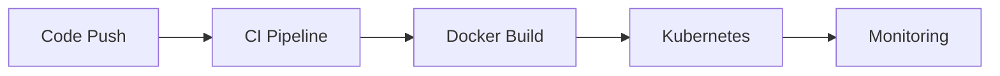

<div align="center">

# 🚀 CloudForge

### DevOps • Cloud • Automation • CI/CD


<br>


</div>

---

## ⚡ About

CloudForge is a DevOps automation platform designed to streamline infrastructure provisioning, CI/CD pipelines, container orchestration, and cloud deployments.

---

## 🏗️ Stack

```text
GitHub → Jenkins → Docker → Kubernetes → AWS
```

---

## 🔥 Features

✅ Infrastructure as Code

✅ CI/CD Automation

✅ Docker Containerization

✅ Kubernetes Deployment

✅ Cloud Infrastructure

✅ Monitoring & Logging

---

## 📂 Structure

```bash
.
├── terraform/
├── kubernetes/
├── docker/
├── jenkins/
├── scripts/
└── README.md
```

---

## 📈 Workflow



---

## 🚀 Quick Start

```bash
git clone <repo-url>

cd CloudForge

terraform init

terraform apply

kubectl apply -f kubernetes/
```

---

## 📊 Project Highlights

🏗️ Infrastructure as Code

⚙️ Automated Deployments

☁️ Cloud Native Architecture

🔒 DevSecOps Ready

📈 Scalable & Production Ready

---

## 👨‍💻 Author

**Muhammad Ahmad**

DevOps Engineer | Cloud Enthusiast | Automation Advocate

---

<div align="center">

### ⭐ Star this repository if you find it useful!

</div>
