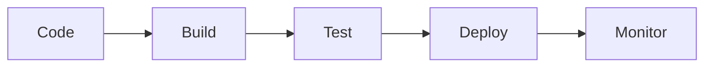

<div align="center">
  
# ☁️ CloudDevOps

# 

</div><div align="center">
  
<br>

</div>

---

### 🚀 About

Building scalable cloud infrastructure, automated CI/CD pipelines, and production-ready Kubernetes platforms.

---

### ⚡ Stack

```text
GitHub → Jenkins → Docker → Kubernetes → AWS
```

---

### 🔥 Focus Areas

```text
☁️ Cloud Engineering
⚙️ DevOps Automation
☸ Kubernetes
🏗 Infrastructure as Code
📊 Monitoring & Observability
🔒 DevSecOps
```

---

### 📈 Delivery Flow



---

<div align="center">

### Automate Everything • Deploy Anywhere • Scale Reliably

</div>
