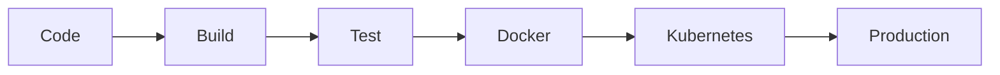

<div align="center">

# ☁️ CF

### 🚀 Automate • Deploy • Scale


<br>


<br>


</div>

---

## ⚡ Stack

```text
GitHub → Jenkins → Docker → Kubernetes → AWS
```

---

## 🔥 Core Features

✅ CI/CD Automation

✅ Infrastructure as Code

✅ Containerized Deployments

✅ Kubernetes Orchestration

✅ Cloud Infrastructure

✅ Monitoring & Observability

---

## 📊 Pipeline



---

## 🚀 Quick Start

```bash
git clone https://github.com/YOUR_USERNAME/YOUR_REPO.git

cd YOUR_REPO

terraform init

terraform apply
```

---

<div align="center">

### ⭐ Built with DevOps Excellence


</div>
